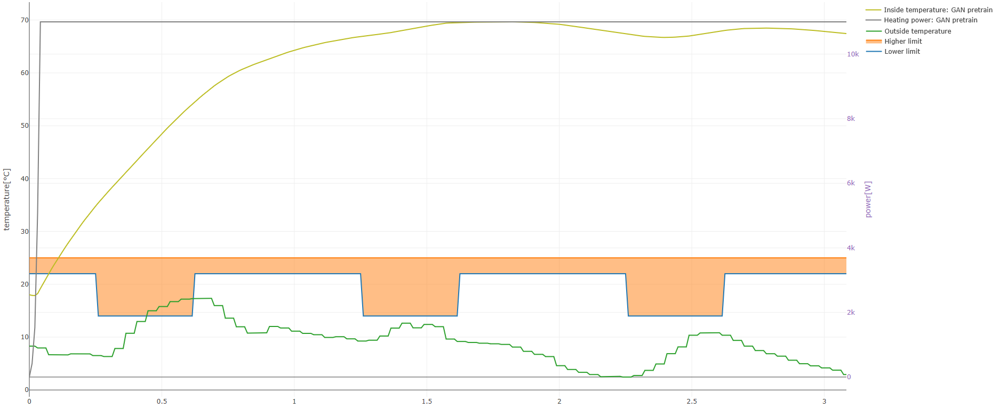
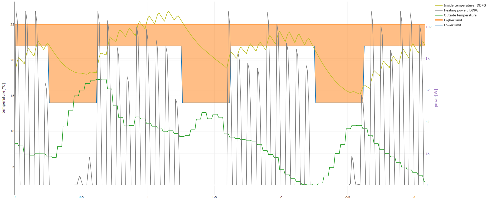

# thermoAI

This project is created to provide a general heating system controller with Reinforcement Learning. 

Main goals:
* Is it possible to control with RL safely --> hold the temperatures in the predefined range
* Is it possible to be more optimal --> reduce cost
* Learn a bit about the continuous control

## Modules
### Simulator
This is the most important part of the training for the predefined heat-model and data-driven model-based RL as well. The model is way too simple compared to a normal simulator. The reason behind this is that the simulator must be fast. 
### Controller
The collection of well known controlling tools and RL tools.

Controlling tools:
* Classic controlling: 
    * PID with minor modifications for this environment
* Reinforcement learning:
    * Deep Deterministic Policy Gradient (model-free)
    * Proximal Policy Optimization (model-free)
    * Soft Actor-Critic (model-free)
    * itarative Linear Quadratic Regulator (model-based)

## Use
Install dependencies:

```pip install -r requirements.txt```

Train the methods and save the policy:

```python train.py```

Evaluate the policies and provide a graph about the performance:

```python evaluate.py```

## Interesting lessons I learned from experimenting
Even if my domain knowledge would be outstanding, it is a really hard problem to create a real-world RL application.

### Simulator
Problems:
* What should be the state features:
    * Previous inside and outside temperatures
    * Expected inside and outside temperature
    * Historical heating power
    * Expected energy prices in the future
* What is the right reward function:
    * Inside temperature penalty:
        * Big penalty for being outside of the desired inside temperature interval
        * MSE from the desired interval if it is outside (be close if it is not possible being inside)
    * Cost of the used energy
* Using realistic data
    * Weather: I used Basel hourly temperature from 2016-2017 winter
    * Energy cost: Hungarian daytime and night time pricing is used

As this is the most important part of the RL pipeline, it is very important to be bug-free, so sufficient unit tests are needed.

### PID Controller
The simulator is linear, so PID should solve the controlling nearly optimal. However, it doesn't use the information about the energy price --> it may suboptimal
Problems
* The modeled system is linear and has no delay in the temperature response, which suggests the integrator part and derivative part is useless. Only P must be set.
* The current inside temperature is not enough information, so I combined it with a the outside information
* Knowing the currently required temperature is not enough, so a few steps forward seeing is required

Otherwise, this is not too complicated as the heating system model is linear 


This figure shows the PID control the temperature almost perfectly. The orange part shows the required inside temperature interval. 

### Imitation learning

The goal of imitation learning was to mimic the PID controlling. It sounds like an easy supervised ML problem... well it isn't that easy...
The NNs are designed to be smooth, but the PID controlling contains spikes because the target temperature contains step function.

I tried different loss functions:
* Mean Squared Error (MSE)

* Mean Average Error (MAE)

* Adversarial training: The idea is using a neural network to predict whether the state+action pair comes from the PID controller or the imitation learning policy. The policy is trained according to the GAN rule.

Another interesting aspect of this method is inverse RL. The inverse RL scenario converts a policy and simulator to a reward function. It can be helpful for designing a reward function.
During inverse RL Neural network provide the reward based on action and state. In inverse RL the "discriminator" provides reward function and instead of imitation learning model-free RL happens. This results in maximal reward difference for the current policy and any other policy. 
However, the adversarial method performs poor, so I couldn't solve the inverse RL case yet.

According to the results MAE is chosen for being the initial point for model-free RL. 

For Q function based method, it is essential to learn the critic as well.
Another interesting problem with pretraining Actor-Critic architecture is training Critic with "optimal" policy's values causes discrepancy between the value function for learned policy and teacher policy.
This problem can be eliminated by learning the policy first and use the learned policy's Q-values for the critic target.
My intuition: MAE performs the best as the system is fully linear. 

### Model-Free reinforcement learning
In my experience, the heating problem is way too complicated for model free-RL. That is why not converging not necessarily means that the implementation wrong.
I used OpenAI gym inverted pendulum and continuous cartpole task to check convergence. The algorithms work for the given tasks. This can be the unit test of the implementation.

Without any further trick the model tends to predict one of the corner case of the valid interval.
Due to the previous reasons, I decided to use pre-training for the models. The baseline is the PID and imitation learning is used as a pretrained-model can see in the previous section.

Implemented methods:
* [DDPG](https://arxiv.org/pdf/1509.02971.pdf) 


* [SAC](https://arxiv.org/pdf/1801.01290.pdf): State-of-the-art model-free RL method handles the exploration as well and converges really fast on inverted pendulum problem. Pretraining is a bit more difficult in this case due to the 6 different networks.

* [PPO](https://arxiv.org/pdf/1707.06347.pdf) 
 This is an on-policy algorithm with some constraint, which provides to not moving too far from the current policy. This is why it seems like a more stable method for pre-training.


The results show that even the pre-training model-free RL not working perfectly (yet), but pre-trained PPO is able to control the system more or less, but not optimally. 
Training the models further result that the control increases the inside temperature further, which is very odd. Furthermore, these methods tend to broke later and provide the maximum or the minimum heating power during the controlling process, which is very similar to the model-free RL from scratch case.

See the interactive plots [here](heating_plot.html)

### Model-based reinforcement learning
iLQR method is really slow. The main advantage is able to converge faster than SAC, if not counting the model-learning steps, which are passive steps.
Interesting discovery: TF2.0 can calculate the Hessian matrix (d cost/dd input), which is required, but the network must contain non-ReLu activation as well because the hessian of ReLu network will be zero matrix.
Anyway, model-based RL is cool, but speeding up is required in inference time, which can be solved with Guided Policy Search.


